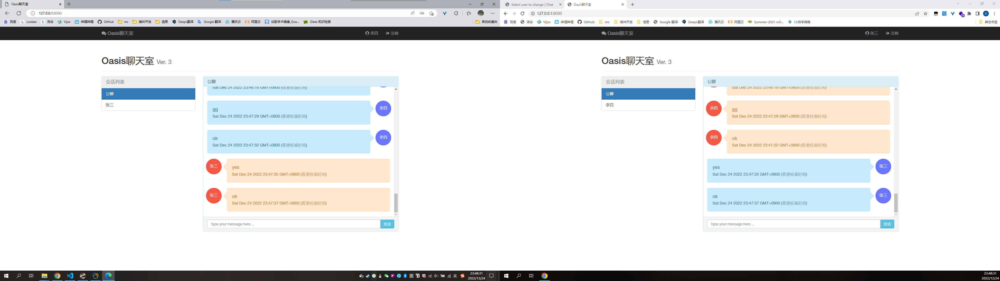

# WebChat

Final assignment for the course "Web development and application" at 2022 fall semester, SSDUT.



## Architecture

- Using jQuery and Bootstrap for the frontend.

- Using Django and Channels 2 for the backend. Daphne for the ASGI server. Redis as the channel layer backing store. MySQL as the database.

## How it works

- When a user logs in, the frontend downloads the user list and opens a
   Websocket connection to the server (notifications channel).

- When a user selects another user to chat, the frontend downloads the latest
   50 messages (configurable).

- When a user sends a message, the frontend sends a POST to the REST API, then Django saves the message and notifies the users involved using the Websocket connection (sends the new message ID).

- When the frontend receives a new message notification (with the message ID), it performs a GET query to the API to download the received message.

## Run the project

1. Install requirements

   I use venv to manage the virtual environment. You can use other tools instead. Since `requirements.txt` is provided, you can use `pip` to install the dependencies directly.

   ```bash
   pip install -r requirements.txt
   ```

2. Run docker-compose

   I use docker-compose to run the project. You can manage your environment manually. Since `docker-compose.yml` is provided, you can use `docker-compose` to get the environment directly.

   ```bash
   docker-compose up
   ```

3. Migration

   ```bash
   python manage.py migrate
   ```

4. Create admin user (may be you need 2 to test the chat)

   ```bash
   python manage.py createsuperuser
   ```

5. To override default settings, create a `local_settings.py` file in the `chat` folder.

6. Run development server

   ```bash
   python manage.py runserver
   ```
